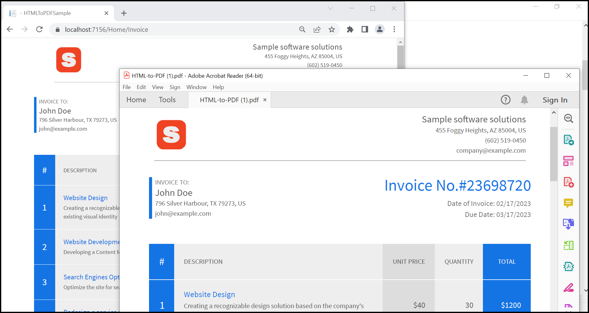

# Convert HTML to PDF in ASP.NET Core application

## Introduction
The Syncfusion HTML to PDF converter is a .NET library used to convert HTML or web pages to PDF document in ASP.NET Core application.

## System requirement
### Framework and SDKs:
* .NET Core SDK (version 3.1 or later)

### IDEs:
*  Visual Studio 2019/ Visual Studio 2022 
*  Visual Studio Code 

## Code snippet to convert HTML to PDF
we will create a existing ASP.Net Core application, add the Syncfusion HTML to PDF library package, and write the code

```csharp
    HtmlToPdfConverter converter = new HtmlToPdfConverter();
    BlinkConverterSettings blinkConverterSettings = new BlinkConverterSettings();
    blinkConverterSettings.ViewPortSize = new Syncfusion.Drawing.Size(800, 0);
    converter.ConverterSettings = blinkConverterSettings;
    using (PdfDocument document = converter.Convert("https://localhost:7156/Home/Invoice"))
    {
        MemoryStream stream = new MemoryStream();
        document.Save(stream);
        stream.Position = 0;
        return File(stream, "application/pdf", "HTML-to-PDF.pdf");
    }
```
**Invoice URL Image**


**Output Image**

